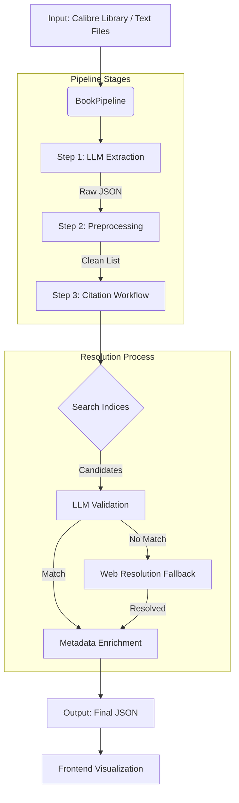
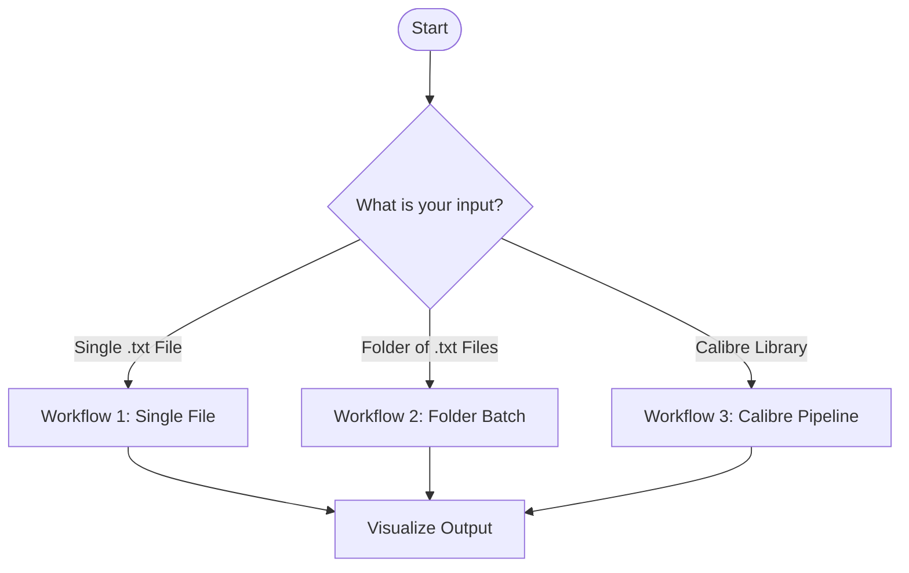

# BookGraph Revisited

A high-performance pipeline for extracting, resolving, and visualizing book and author citations from large text corpora.

## Overview

This system processes raw text files (books) to find citations of other books and authors. It uses LLMs for extraction, a specialized validation agent to resolve citations against Goodreads/Wikipedia, and an automatic web fallback for obscure references.

**Key Features:**
*   **Pipeline Architecture**: Modular `BookPipeline` that handles extraction, preprocessing, and resolution.
*   **LLM Extraction**: Uses prompt-based extraction (compatible with OpenAI-like APIs).
*   **Agentic Resolution**: A `CitationWorkflow` (LlamaIndex-based) that searches fuzzy matches and validates them with an LLM.
*   **Web Resolution Fallback**: Automatic fallback to agentic web search (using LLM knowledge) when local resolution fails.
*   **Calibre Integration**: Native support for processing Calibre libraries, leveraging existing metadata.
*   **Visualization**: D3.js frontend for exploring the citation graph, timeline, and commentaries.

## Architecture



## Setup

### Prerequisites
*   Python 3.10+
*   `uv` (Universal Python Package Manager)
*   LLM API Provider (e.g., OpenRouter)

### Installation

1.  **Clone & Install**:
    ```bash
    git clone https://github.com/thiago-lira/bookgraph-revisited.git
    cd bookgraph-revisited
    uv sync
    ```

2.  **Environment Variables**:
    Create a `.env` file:
    ```bash
    export OPENROUTER_API_KEY="sk-..."
    export OPENROUTER_BASE_URL="https://openrouter.ai/api/v1"
    ```

## standard Workflows

Choose the workflow that matches your input data:



### 1. Single File Experiment (`run_single_file.py`)
Best for testing extraction on a specific book or essay.

**Command**:
```bash
uv run run_single_file.py <INPUT_PATH> \
    --output-dir outputs/single_runs/<ID> \
    --book-title "<TITLE>" \
    --author "<AUTHOR>" \
    --goodreads-id <ID>
```

**Example**:
```bash
uv run run_single_file.py evaluation/DFW-PLURIBUS.txt \
  --output-dir outputs/single_runs/dfw_pluribus \
  --book-title "E Unibus Pluram" \
  --author "David Foster Wallace" \
  --goodreads-id dfw_pluribus
```

### 2. Folder Batch Process (`run_folder.py`)
Best for processing a directory of text files in parallel.

**Command**:
```bash
uv run run_folder.py <FOLDER_PATH> --workers 5
```

**Example**:
```bash
uv run run_folder.py datasets/test_books/ --workers 5
```

### 3. Calibre Library (`calibre_citations_pipeline.py`)
Best for ingesting an entire Calibre library (requires `metadata.db`).

**Command**:
```bash
uv run calibre_citations_pipeline.py <LIBRARY_DIR> \
    --agent-max-concurrency 10
```

## Visualization

To view your results in the frontend, use the **universal registration tool**. It automatically handles file copying and configuration updates.

**Command:**
```bash
uv run python scripts/register_dataset.py <OUTPUT_DIR> --name "My Dataset Title"
```

**What it does:**
1.  **Scans** the `<OUTPUT_DIR>` for the final resolved JSON files.
2.  **copies** them to `frontend/data/`.
3.  **Generates** a `manifest.json`.
4.  **Updates** `frontend/datasets.json`.

**Example:**
```bash
uv run python scripts/register_dataset.py outputs/single_runs/dfw_pluribus --name "DFW: E Unibus Pluram"
```

Then open `http://localhost:8000` (run `python -m http.server` in `frontend/` if needed).

## Logic Details

### Web Resolution Fallback
If a citation cannot be found in our local database:
1.  **LLM Prompt**: The system asks the LLM to identify the book/person based on context, ensuring strictly chronological validity.
2.  **Synthetic ID**: A deterministic ID (`web_md5hash`) is generated from the title/year.
3.  **Fallback**: This allows the graph to remain connected even without Goodreads IDs.

### Output Structure
```
outputs/run_name/
├── raw_extracted_citations/        # Step 1: Raw LLM output
├── preprocessed_extracted_citations/ # Step 2: Cleaned
└── final_citations_metadata_goodreads/ # Step 3: Final Graph JSON
```

## Development

*   **Extraction**: `lib/extract_citations.py`
*   **Pipeline**: `lib/main_pipeline.py`
*   **Agent**: `lib/bibliography_agent/citation_workflow.py`
*   **Frontend**: `frontend/` (D3.js Visualization)
