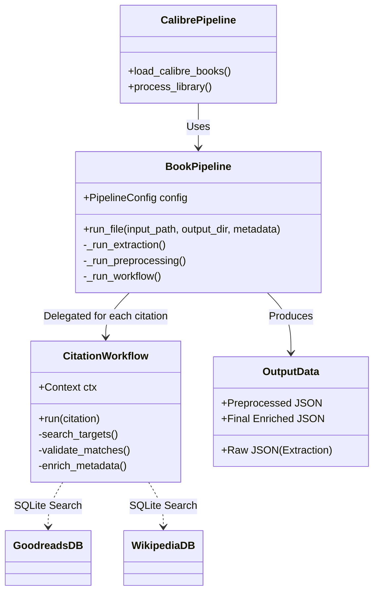
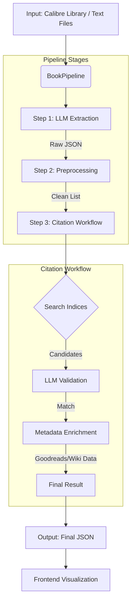

# BookGraph Revisited

A high-performance pipeline for extracting, resolving, and visualizing book and author citations from large text corpora (specifically Calibre libraries).

## Overview

This system processes raw text files (books) to find citations of other books and authors. It uses LLMs for extraction and a specialized validation agent to resolve these citations against Goodreads and Wikipedia data.

**Key Features:**
*   **Pipeline Architecture**: Modular `BookPipeline` that handles extraction, preprocessing, and resolution.
*   **LLM Extraction**: Uses prompt-based extraction (compatible with OpenAI-like APIs) to find citations in text chunks.
*   **Agentic Resolution**: A `CitationWorkflow` (LlamaIndex-based) that searches fuzzy matches, validates them with an LLM, and enriches them with Wikipedia metadata.
*   **Calibre Integration**: Native support for processing Calibre libraries, using existing metadata to aid resolution.
*   **Visualization**: D3.js frontend for exploring the citation graph and author timelines.

## Architecture





## Setup

### Prerequisites
*   Python 3.10+
*   `uv` (Universal Python Package Manager) recommended
*   An LLM API Provider (e.g., OpenRouter) with a compatible model (Recommended: `qwen/qwen-2.5-72b-instruct` or similar).

### Installation

1.  **Clone the repository**:
    ```bash
    git clone https://github.com/thiago-lira/bookgraph-revisited.git
    cd bookgraph-revisited
    ```

2.  **Install dependencies**:
    ```bash
    uv sync
    ```

3.  **Environment Variables**:
    Create a `.env` file or export variables:
    ```bash
    export OPENROUTER_API_KEY="sk-..."
    # Optional defaults
    export OPENROUTER_BASE_URL="https://openrouter.ai/api/v1"
    ```

## Usage

### 1. Process a Single File
Good for testing the pipeline on a specific text file.

```bash
uv run run_single_file.py /path/to/book.txt \
    --output-dir ./my_output \
    --model "qwen/qwen-2.5-72b-instruct"
```

### 2. Process a Folder of Text Files
Process all `*.txt` files in a directory.

```bash
uv run run_folder.py /path/to/books_folder/ \
    --workers 5
```

### 3. Process a Calibre Library
Process an exported Calibre library. Requires `metadata.db` and text files.

```bash
uv run calibre_citations_pipeline.py /path/to/calibre/library/ \
    --agent-concurrency 10
```

Outputs are saved to `outputs/calibre_libs/<library_name>/`.

## Output Structure

The pipeline generates outputs in the `outputs/` directory by default:

- **Calibre**: `outputs/calibre_libs/<library_name>/`
- **Single File**: `outputs/single_runs/`
- **Folder**: `outputs/folder_runs/`

Inside each run folder, you will find:

```
run_folder/
├── raw_extracted_citations/        # Step 1: Raw LLM output (noisy)
│   └── {book_id}.json
├── preprocessed_extracted_citations/ # Step 2: Deduplicated & Cleaned
│   └── {book_id}.json
└── final_citations_metadata_goodreads/ # Step 3: Fully Resolved & Enriched
    └── {book_id}.json
```

**Final JSON Format:**
```json
{
  "source": { ...book metadata... },
  "citations": [
    {
      "edge": {
        "target_book_id": "12345",
        "target_author_ids": ["67890"],
        "target_type": "book"
      },
      "wikipedia_match": { ...wiki metadata... },
      "goodreads_match": { ...goodreads metadata... }
    }
  ]
}
```

## Development

*   **Extraction Logic**: `lib/extract_citations.py`
*   **Pipeline Logic**: `lib/main_pipeline.py`
*   **Agent Workflow**: `lib/bibliography_agent/citation_workflow.py`
*   **Frontend**: `frontend/` (D3.js visualization)

### Testing
```bash
pytest tests/
```
