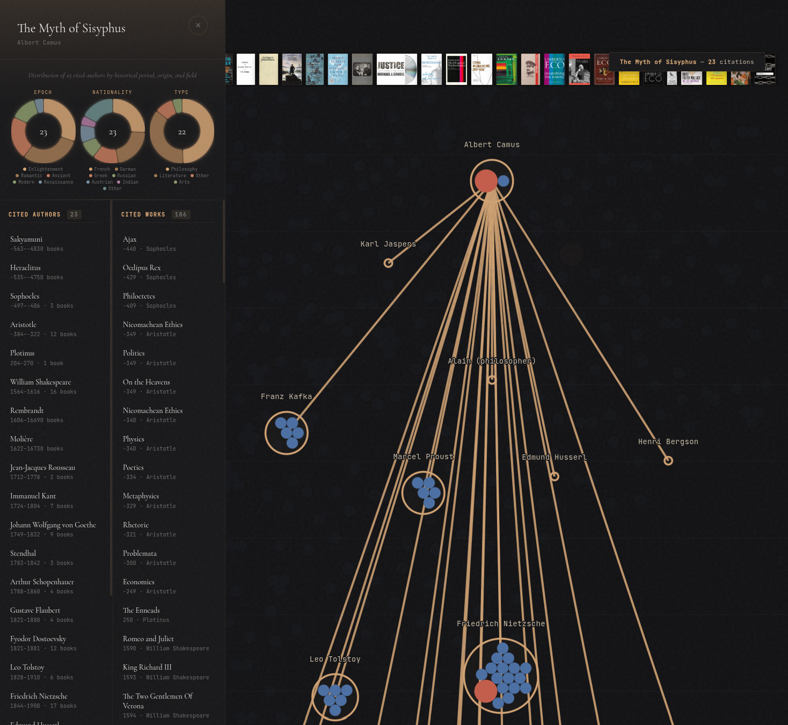
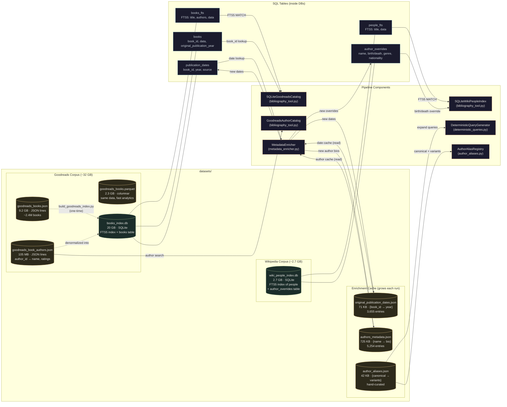

# BookGraph Revisited

A high-performance pipeline for extracting, resolving, and visualizing book and author citations from large text corpora.



## Overview

This system processes raw text files (books) to find citations of other books and authors. It uses LLMs for extraction, a specialized validation agent to resolve citations against Goodreads/Wikipedia, and an automatic web fallback for obscure references.

**Key Features:**
*   **4-Stage Pipeline**: Modular `BookPipeline` — enrich, extract, clean, resolve.
*   **LLM Extraction**: Prompt-based extraction via OpenRouter (OpenAI-compatible API).
*   **Agentic Resolution**: A `CitationWorkflow` (LlamaIndex Workflow) that searches fuzzy matches and validates them with an LLM.
*   **Web Resolution Fallback**: Automatic fallback to LLM knowledge when local databases fail.
*   **Calibre Integration**: Native support for processing Calibre libraries, leveraging existing metadata.
*   **Checkpointing**: Pipeline saves progress every 5 citations and can resume from interruptions.
*   **Persistent Enrichment**: Publication dates and author metadata accumulate across runs in both JSON and SQL.
*   **Visualization**: D3.js frontend with focus mode for exploring dense citation networks.

## Architecture


```mermaid
flowchart TD
    %% ── Input ──────────────────────────────────────────────
    INPUT[/"Input: .txt files<br/>(Title_GoodreadsID.txt)"/]
    INPUT --> ENRICH

    %% ── Stage 0: Source Enrichment ─────────────────────────
    subgraph STAGE0["Stage 0 — Source Metadata Enrichment"]
        ENRICH["_enrich_source_metadata()"]
        ENRICH --> GR_LOOKUP["Goodreads Catalog<br/>FTS5 title match"]
        GR_LOOKUP -->|"authors, pub_year"| ENRICH_MERGE["Merge into<br/>source_metadata"]
        ENRICH -->|"still missing?"| LLM_SOURCE["LLM Fallback<br/>(acomplete → JSON)"]
        LLM_SOURCE --> ENRICH_MERGE
        ENRICH_MERGE --> AUTHOR_META_SRC["enrich_author()<br/>4-source cascade"]
        AUTHOR_META_SRC --> ENRICHED_META[/"Enriched source_metadata"/]
    end

    ENRICHED_META --> EXTRACT

    %% ── Stage 1: Extraction ───────────────────────────────
    subgraph STAGE1["Stage 1 — LLM Extraction  (extract_citations.py)"]
        EXTRACT["process_book()"]
        EXTRACT --> SENT["NLTK sent_tokenize()"]
        SENT --> CHUNK["build_chunks()<br/>token-budget aware"]
        CHUNK --> PARALLEL_LLM["Async LLM calls<br/>(semaphore-limited)"]
        PARALLEL_LLM -->|"JSON schema enforced"| PARSE["Pydantic parse<br/>→ {title?, author?,<br/>contexts[], commentaries[]}"]
        PARSE -->|"retry x2"| PARALLEL_LLM
        PARSE --> RAW_OUT[/"raw_extracted_citations/<br/>BookID.json"/]
    end

    RAW_OUT --> CLEAN

    %% ── Stage 2: Cleaning ───────────────────────────────
    subgraph STAGE2["Stage 2 — Heuristic + LLM Cleaning  (clean_citations.py)"]
        CLEAN["clean_citations()"]
        CLEAN --> FLATTEN["Flatten chunks →<br/>single citation list"]
        FLATTEN --> DEDUP["deduplicate_exact()"]
        DEDUP --> H_CHAIN["Heuristic chain:<br/>filter_non_person →<br/>collapse_author_only →<br/>collapse_variant_titles →<br/>merge_similar →<br/>drop_self_references"]
        H_CHAIN --> VAL_LLM["LLM batch validation<br/>keep / fix / remove"]
        VAL_LLM --> CLEANED_OUT[/"cleaned_citations/<br/>BookID.json"/]
    end

    CLEANED_OUT --> WORKFLOW

    %% ── Stage 3: Resolution ────────────────────────────
    subgraph STAGE3["Stage 3 — Resolution + Enrichment + Dedup"]

        WORKFLOW["_run_workflow()<br/>CheckpointManager +<br/>AuthorCache"]
        WORKFLOW --> CACHE_CHECK{"Author cache hit?"}
        CACHE_CHECK -->|"hit"| CACHE_RESULT["Use cached result"]
        CACHE_CHECK -->|"miss"| CIT_WORKFLOW["CitationWorkflow.run()"]

        subgraph WF["CitationWorkflow Steps"]
            direction TB
            GEN_Q["generate_queries()<br/>attempt 0: deterministic<br/>attempt 1+: LLM"]
            GEN_Q --> SEARCH_GR["search_goodreads()<br/>FTS5"]
            GEN_Q --> SEARCH_WIKI["search_wikipedia()<br/>FTS5"]
            SEARCH_GR --> VALIDATE_M["validate_matches()<br/>LLM structured_predict()"]
            SEARCH_WIKI --> VALIDATE_M
            VALIDATE_M --> AGG["aggregate_results()"]
            AGG -->|"not_found &<br/>retries < 3"| GEN_Q
            AGG --> WF_OUT["Return match"]
        end

        CIT_WORKFLOW --> WF
        WF --> FB_CHECK{"not_found?"}
        FB_CHECK -->|"yes"| FALLBACK["LLM Fallback<br/>resolve_citation_fallback()"]
        FB_CHECK -->|"no"| ENRICH_S

        FALLBACK --> ENRICH_S

        subgraph ENR["Metadata Enrichment"]
            ENRICH_S["Enrich citation"]
            ENRICH_S --> E_BOOK["enrich_book()<br/>Cache → Goodreads scraper →<br/>Wikipedia → LLM"]
            ENRICH_S --> E_AUTH["enrich_author()<br/>Cache → Local Wiki DB →<br/>Wikipedia web → LLM<br/>→ validate_dates()"]
            E_BOOK --> BUILD
            E_AUTH --> BUILD
            BUILD["build_result_dict()"]
        end

        CACHE_RESULT --> RESULTS
        BUILD --> RESULTS["Append to results"]
        RESULTS -->|"every 5"| CKPT[("checkpoint.json")]
        RESULTS --> DEDUP_POST["dedup_resolved_citations()"]
        DEDUP_POST --> SAVE["enricher.save()<br/>→ JSON + SQL"]
    end

    SAVE --> FINAL[/"final_citations_metadata_goodreads/<br/>BookID.json"/]
    FINAL --> REGISTER

    subgraph FE["Frontend"]
        REGISTER["register_dataset.py"]
        REGISTER --> D3["D3.js Visualization"]
    end

    %% ── Styling ───────────────────────────────────────────
    classDef stage fill:#1a1a2e,stroke:#d4a574,color:#e8e6e3
    classDef io fill:#0d1117,stroke:#4a6fa5,color:#c9d1d9
    classDef llm fill:#2d1b3d,stroke:#b48ead,color:#e8e6e3
    classDef db fill:#1b2d2a,stroke:#a3be8c,color:#e8e6e3
    classDef checkpoint fill:#2d2a1b,stroke:#ebcb8b,color:#e8e6e3

    class STAGE0,STAGE1,STAGE2,STAGE3 stage
    class INPUT,RAW_OUT,CLEANED_OUT,FINAL,ENRICHED_META io
    class PARALLEL_LLM,VAL_LLM,LLM_SOURCE,GEN_Q,VALIDATE_M,FALLBACK llm
    class GR_LOOKUP,SEARCH_GR,SEARCH_WIKI db
    class CKPT checkpoint
```

## Data Architecture

All persistent data lives in `datasets/`. The pipeline reads from these at startup and writes back enriched results at the end of each run. JSON files are the primary format; SQL tables mirror them for fast querying.


```mermaid
flowchart LR
    %% ── Nodes ─────────────────────────────────────────────
    subgraph DATASETS["datasets/"]
        direction TB

        subgraph GR_DATA["Goodreads Corpus  (~32 GB)"]
            GR_JSON[("goodreads_books.json<br/>9.2 GB · JSON lines<br/>~2.4M books")]
            GR_AUTHORS_JSON[("goodreads_book_authors.json<br/>105 MB · JSON lines<br/>author_id → name, ratings")]
            GR_PARQUET[("goodreads_books.parquet<br/>2.3 GB · columnar<br/>same data, fast analytics")]
            BOOKS_DB[("books_index.db<br/>20 GB · SQLite<br/>FTS5 index + books table")]
        end

        subgraph WIKI_DATA["Wikipedia Corpus  (~2.7 GB)"]
            WIKI_DB[("wiki_people_index.db<br/>2.7 GB · SQLite<br/>FTS5 index of people<br/>+ author_overrides table")]
        end

        subgraph ENRICHMENT["Enrichment Cache  (grows each run)"]
            DATES_JSON[("original_publication_dates.json<br/>71 KB · {book_id → year}<br/>3,655 entries")]
            AUTHORS_META[("authors_metadata.json<br/>725 KB · {name → bio}<br/>5,254 entries")]
            ALIASES_JSON[("author_aliases.json<br/>42 KB · {canonical → variants}<br/>hand-curated")]
        end
    end

    %% ── Pipeline reads ────────────────────────────────────
    subgraph PIPELINE["Pipeline Components"]
        direction TB
        CATALOG["SQLiteGoodreadsCatalog<br/>(bibliography_tool.py)"]
        WIKI_CAT["SQLiteWikiPeopleIndex<br/>(bibliography_tool.py)"]
        GR_AUTH_CAT["GoodreadsAuthorCatalog<br/>(bibliography_tool.py)"]
        DET_Q["DeterministicQueryGenerator<br/>(deterministic_queries.py)"]
        ALIAS_REG["AuthorAliasRegistry<br/>(author_aliases.py)"]
        ENRICHER["MetadataEnricher<br/>(metadata_enricher.py)"]
    end

    subgraph SQL_TABLES["SQL Tables (inside DBs)"]
        direction TB
        BOOKS_FTS["books_fts<br/>FTS5: title, authors, data"]
        BOOKS_TBL["books<br/>book_id, data, original_publication_year"]
        PUB_DATES_TBL["publication_dates<br/>book_id, year, source"]
        PEOPLE_FTS["people_fts<br/>FTS5: title, data"]
        OVERRIDES_TBL["author_overrides<br/>name, birth/death, genre, nationality"]
    end

    %% ── Build-time connections ────────────────────────────
    GR_JSON -.->|"build_goodreads_index.py<br/>(one-time)"| BOOKS_DB
    GR_AUTHORS_JSON -.->|"denormalized into"| BOOKS_DB

    %% ── DB contains tables ───────────────────────────────
    BOOKS_DB --- BOOKS_FTS
    BOOKS_DB --- BOOKS_TBL
    BOOKS_DB --- PUB_DATES_TBL
    WIKI_DB --- PEOPLE_FTS
    WIKI_DB --- OVERRIDES_TBL

    %% ── Runtime reads ─────────────────────────────────────
    BOOKS_FTS -->|"FTS5 MATCH"| CATALOG
    BOOKS_TBL -->|"book_id lookup"| CATALOG
    PUB_DATES_TBL -->|"date lookup"| ENRICHER
    PEOPLE_FTS -->|"FTS5 MATCH"| WIKI_CAT
    OVERRIDES_TBL -->|"birth/death override"| WIKI_CAT
    GR_AUTHORS_JSON -->|"author search"| GR_AUTH_CAT
    ALIASES_JSON -->|"canonical + variants"| ALIAS_REG
    ALIASES_JSON -->|"expand queries"| DET_Q
    DATES_JSON -->|"date cache (read)"| ENRICHER
    AUTHORS_META -->|"author cache (read)"| ENRICHER

    %% ── Runtime writes (enricher.save()) ──────────────────
    ENRICHER -->|"new dates"| DATES_JSON
    ENRICHER -->|"new dates"| PUB_DATES_TBL
    ENRICHER -->|"new author bios"| AUTHORS_META
    ENRICHER -->|"new overrides"| OVERRIDES_TBL

    %% ── Styling ───────────────────────────────────────────
    classDef db fill:#1b2d2a,stroke:#a3be8c,color:#e8e6e3
    classDef json fill:#2d2a1b,stroke:#ebcb8b,color:#e8e6e3
    classDef code fill:#1a1a2e,stroke:#d4a574,color:#e8e6e3
    classDef sql fill:#1b1b2d,stroke:#88c0d0,color:#c9d1d9
    classDef corpus fill:#0d1117,stroke:#4a6fa5,color:#c9d1d9

    class BOOKS_DB,WIKI_DB db
    class DATES_JSON,AUTHORS_META,ALIASES_JSON,GR_JSON,GR_AUTHORS_JSON,GR_PARQUET json
    class CATALOG,WIKI_CAT,GR_AUTH_CAT,DET_Q,ALIAS_REG,ENRICHER code
    class BOOKS_FTS,BOOKS_TBL,PUB_DATES_TBL,PEOPLE_FTS,OVERRIDES_TBL sql
```

## Setup

### Prerequisites
*   Python 3.10+
*   `uv` (Universal Python Package Manager)
*   OpenRouter API key

### Installation

1.  **Clone & Install**:
    ```bash
    git clone https://github.com/thiago-lira/bookgraph-revisited.git
    cd bookgraph-revisited
    uv sync
    ```

2.  **Environment Variables**:
    Create a `.env` file:
    ```bash
    OPENROUTER_API_KEY="sk-..."
    ```

---

## Standard Workflows

### Workflow 1: From Calibre to Visualization (Recommended)

This is the most common workflow for processing your personal library.

#### Step 1: Export books from Calibre

1. Open Calibre and select the books you want to analyze
2. Right-click → **Convert books** → **Bulk convert**
3. Set **Output format: TXT**
4. Click OK and wait for conversion

#### Step 2: Prepare input files

Create a folder and rename your files to include Goodreads IDs:

```bash
mkdir -p input_books/libraries/my_library_$(date +%Y%m%d)
```

**Important:** Name files as `Title_GOODREADS_ID.txt`:
```
The_Republic_30289.txt
Beyond_Good_and_Evil_7529.txt
Meditations_30659.txt
```

The Goodreads ID is the number from the book's URL: `goodreads.com/book/show/30289`

#### Step 3: Run the pipeline

```bash
# Preview what will be processed
uv run python run_folder.py input_books/libraries/my_library_20260128 --dry-run

# Run with 5 parallel workers
uv run python run_folder.py input_books/libraries/my_library_20260128 --workers 5
```

#### Step 4: Register for frontend

```bash
uv run python scripts/register_dataset.py \
    outputs/folder_runs/run_20260128-123456 \
    --name "My Personal Library"
```

#### Step 5: View the visualization

```bash
cd frontend && python -m http.server 8000
# Open http://localhost:8000
```

---

### Workflow 2: Single File Experiment

Best for testing extraction on a specific book or essay.

```bash
uv run python run_single_file.py evaluation/DFW-PLURIBUS.txt \
  --output-dir outputs/single_runs/dfw_pluribus \
  --book-title "E Unibus Pluram" \
  --author "David Foster Wallace" \
  --goodreads-id 6751
```

---

### Workflow 3: Calibre Pipeline (Direct)

Process a Calibre library directly (reads `metadata.db` for Goodreads IDs):

```bash
uv run python calibre_citations_pipeline.py /path/to/calibre/library --workers 5
```

---

## Output Structure

After running the pipeline:

```
outputs/folder_runs/run_YYYYMMDD-HHMMSS/
├── pipeline.log                              # Full debug log
├── raw_extracted_citations/                  # Stage 1: Raw LLM output
│   └── 12345.json
├── cleaned_citations/                        # Stage 2: Cleaned + validated
│   └── 12345.json
└── final_citations_metadata_goodreads/       # Stage 3: Resolved (for frontend)
    └── 12345.json
```

### Checkpoint Recovery

If the pipeline is interrupted, a `.checkpoint.json` file is saved in the final output directory. Re-run the same command to resume from where it left off.

---

## Project Structure

```
bookgraph-revisited/
├── run_single_file.py              # CLI: single book
├── run_folder.py                   # CLI: batch folder
├── calibre_citations_pipeline.py   # CLI: Calibre library
│
├── lib/
│   ├── main_pipeline.py            # BookPipeline orchestrator (4 stages)
│   ├── cli_common.py               # Shared CLI args, config builder, logging
│   ├── llm_client.py               # LLMConfig dataclass, OpenRouter client
│   │
│   ├── extract_citations.py        # Stage 1: LLM extraction
│   ├── clean_citations.py          # Stage 2: heuristic + LLM cleaning
│   ├── metadata_enricher.py        # Enrichment: dates + author bios
│   │
│   ├── text_utils.py               # Shared normalization & fuzzy matching
│   ├── author_aliases.py           # AuthorAliasRegistry
│   ├── checkpoint.py               # CheckpointManager (crash recovery)
│   ├── author_cache.py             # Per-book author result cache
│   ├── dedup.py                    # Post-resolution deduplication
│   ├── edge_builder.py             # Build structured result dicts
│   │
│   ├── goodreads_scraper.py        # Web scraper for publication dates
│   ├── wikipedia_agent.py          # Wikipedia lookup for dates/bios
│   │
│   └── bibliography_agent/
│       ├── citation_workflow.py    # LlamaIndex Workflow (resolution)
│       ├── deterministic_queries.py # Rule-based query generation
│       ├── bibliography_tool.py    # Goodreads/Wikipedia FTS5 catalogs
│       └── events.py               # Workflow event types
│
├── datasets/                       # Core data (see Data Architecture)
│   ├── books_index.db              # Goodreads FTS5 index (20 GB)
│   ├── wiki_people_index.db        # Wikipedia people FTS5 (2.7 GB)
│   ├── goodreads_books.json        # Raw Goodreads dump (9.2 GB)
│   ├── goodreads_book_authors.json # Author metadata (105 MB)
│   ├── author_aliases.json         # Name variant mappings
│   ├── authors_metadata.json       # Enriched author bios (grows)
│   └── original_publication_dates.json  # Publication dates (grows)
│
├── frontend/
│   ├── index.html                  # D3.js visualization
│   ├── js/                         # Modular JS (app, renderer, etc.)
│   ├── css/main.css                # Styling
│   └── data/                       # Registered datasets
│
├── scripts/                        # Utilities, fixes, scanners
│   ├── register_dataset.py         # Register output for frontend
│   ├── build_goodreads_index.py    # Build books_index.db
│   ├── build_wiki_people_index.py  # Build wiki_people_index.db
│   └── ...                         # 60+ maintenance scripts
│
└── .agent/                         # AI agent skills & workflows
    ├── skills/calibre_query/       # Query Calibre library
    ├── skills/goodreads_lookup/    # Lookup Goodreads IDs
    └── workflows/                  # Step-by-step workflow guides
```

---

## Frontend Visualization

### Features

- **Timeline View**: Authors arranged chronologically (ancient at bottom, modern at top)
- **Focus Mode**: Click any author to see a radial view of their citations
- **Drag to Pan**: In focus mode, drag to explore large networks
- **Citation Cards**: Click books/authors to see AI-extracted commentary
- **Search**: Find authors or books by name

### Adding Datasets Manually

1. Create `frontend/data/my_dataset/`
2. Copy final JSON files from pipeline output
3. Create `manifest.json`:
   ```json
   ["book1.json", "book2.json"]
   ```
4. Update `frontend/datasets.json`:
   ```json
   {
       "name": "My Dataset",
       "path": "./data/my_dataset",
       "covers": ["covers/cover.jpg"]
   }
   ```

---

## Configuration

### Pipeline Config

| Option | Default | Description |
|--------|---------|-------------|
| `--workers` | 1 | Parallel file processing |
| `--chunk-size` | 50 | Sentences per extraction chunk |
| `--model` | deepseek/deepseek-v3.2 | LLM model ID (via OpenRouter) |
| `--base-url` | OpenRouter | API endpoint |
| `--agent-concurrency` | 20 | Concurrent citation resolution workflows |
| `--extract-concurrency` | 20 | Concurrent extraction requests |
| `--force-llm-queries` | false | Bypass deterministic query generation |
| `--verbose` | false | Debug logging |

### Author Aliases (`datasets/author_aliases.json`)

Maps variant spellings to canonical names for better matching:

```json
{
  "Laozi": ["Lao-Tze", "Lao Tzu", "Lao-tzu"],
  "Plato": ["Platon"],
  "Fyodor Dostoevsky": ["Dostoyevsky", "Dostoevski"]
}
```

---

## Development

### Key Files

| File | Purpose |
|------|---------|
| `lib/main_pipeline.py` | Pipeline orchestration, config, stage routing |
| `lib/cli_common.py` | Shared CLI utilities (all 3 entry points use this) |
| `lib/llm_client.py` | LLMConfig + OpenRouter client factories |
| `lib/extract_citations.py` | LLM extraction prompts & chunking |
| `lib/clean_citations.py` | Combined heuristic + LLM citation cleaning |
| `lib/bibliography_agent/citation_workflow.py` | LlamaIndex resolution agent |
| `lib/bibliography_agent/bibliography_tool.py` | Goodreads/Wikipedia FTS5 catalogs |
| `lib/metadata_enricher.py` | 4-source enrichment cascade + SQL sync |
| `lib/text_utils.py` | Normalization: authors, titles, fuzzy matching |
| `lib/author_aliases.py` | AuthorAliasRegistry (canonical ↔ variants) |
| `lib/checkpoint.py` | CheckpointManager for crash recovery |
| `lib/dedup.py` | Post-resolution dedup (merge editions) |

### Running Tests

```bash
uv run pytest lib/bibliography_agent/tests/ -x -q
```

### Frontend Customization

Edit CSS variables in `frontend/css/main.css`:

```css
:root {
    --bg: #0a0a0c;           /* Background */
    --accent: #d4a574;        /* Highlight color */
    --book-source: #c45c4a;   /* Source books (red) */
    --book-cited: #4a6fa5;    /* Cited books (blue) */
}
```

---

## Troubleshooting

### "No ID in filename" warning
Add Goodreads IDs to filenames: `Book_Title_12345.txt`

### Pipeline rate limited
Reduce concurrency: `--agent-concurrency 5 --extract-concurrency 5`

### Empty frontend graph
1. Check `manifest.json` lists your files
2. Verify JSON has non-empty `"citations"` array
3. Check browser console for errors

### Focus mode shows nothing
The selected author needs outbound citations to display a network.

---

## For AI Agents

See **[AGENTS.md](AGENTS.md)** for a quick-reference guide optimized for AI agents working with this codebase.
