# BookGraph Revisited

A high-performance pipeline for extracting, resolving, and visualizing book and author citations from large text corpora.

## Overview

This system processes raw text files (books) to find citations of other books and authors. It uses LLMs for extraction, a specialized validation agent to resolve citations against Goodreads/Wikipedia, and an automatic web fallback for obscure references.

**Key Features:**
*   **Pipeline Architecture**: Modular `BookPipeline` that handles extraction, preprocessing, and resolution.
*   **LLM Extraction**: Uses prompt-based extraction (compatible with OpenAI-like APIs).
*   **Agentic Resolution**: A `CitationWorkflow` (LlamaIndex-based) that searches fuzzy matches and validates them with an LLM.
*   **Web Resolution Fallback**: Automatic fallback to agentic web search (using LLM knowledge) when local resolution fails.
*   **Calibre Integration**: Native support for processing Calibre libraries, leveraging existing metadata.
*   **Checkpointing**: Pipeline saves progress and can resume from interruptions.
*   **Visualization**: D3.js frontend with focus mode for exploring dense citation networks.

## Architecture

```mermaid
flowchart TD
    %% ── Input ──────────────────────────────────────────────
    INPUT[/"📁 Input: .txt files<br/>(Title_GoodreadsID.txt)"/]
    INPUT --> ENRICH

    %% ── Stage 0: Source Enrichment ─────────────────────────
    subgraph STAGE0["Stage 0 — Source Metadata Enrichment"]
        ENRICH["_enrich_source_metadata()"]
        ENRICH --> GR_LOOKUP["Goodreads Catalog<br/>SQLite FTS5 lookup"]
        GR_LOOKUP -->|"authors, pub_year"| ENRICH_MERGE["Merge into<br/>source_metadata"]
        ENRICH -->|"missing fields?"| LLM_SOURCE["LLM Fallback<br/>(acomplete → JSON)"]
        LLM_SOURCE -->|"author, year"| ENRICH_MERGE
        ENRICH_MERGE --> AUTHOR_META_SRC["Enrich primary author<br/>birth/death years"]
        AUTHOR_META_SRC -->|"Wiki DB → Web → LLM"| ENRICHED_META[/"Enriched source_metadata<br/>{title, authors, year, author_meta}"/]
    end

    ENRICHED_META --> EXTRACT

    %% ── Stage 1: Extraction ───────────────────────────────
    subgraph STAGE1["Stage 1 — LLM Extraction  (extract_citations.py)"]
        EXTRACT["process_book()"]
        EXTRACT --> SENT["NLTK sent_tokenize()"]
        SENT --> CHUNK["build_chunks()<br/>token-budget aware,<br/>≤50 sentences/chunk"]
        CHUNK --> PARALLEL_LLM["Async LLM calls<br/>(semaphore = extract_concurrency)<br/>OpenAI-compatible API"]
        PARALLEL_LLM -->|"JSON schema enforced<br/>response_format"| PARSE["Pydantic parse<br/>ModelChunkCitations"]
        PARSE -->|"retry ×2 on failure"| PARALLEL_LLM
        PARSE --> RAW_OUT[/"raw_extracted_citations/<br/>BookID.json<br/>{chunks: [{citations: [...]}]}"/]
    end

    RAW_OUT --> PREPROCESS

    %% ── Stage 2: Preprocessing ────────────────────────────
    subgraph STAGE2["Stage 2 — Heuristic Preprocessing  (preprocess_citations.py)"]
        PREPROCESS["preprocess_data()"]
        PREPROCESS --> FLATTEN["Flatten chunks →<br/>flat citation list"]
        FLATTEN --> DEDUP_EXACT["deduplicate_exact()<br/>case-insensitive (title, author)"]
        DEDUP_EXACT --> H1["filter_non_person_authors()<br/>blocklist + pattern filter<br/>(groups, all-caps, generic terms)"]
        H1 --> H2["collapse_author_only()<br/>merge author-only refs"]
        H2 --> H3["collapse_variant_titles()<br/>normalize title prefixes"]
        H3 --> H4["merge_similar_citations()<br/>SequenceMatcher ≥0.85"]
        H4 --> SELF_REF["drop_self_references()<br/>remove source book from results"]
        SELF_REF --> PRE_OUT[/"preprocessed_extracted_citations/<br/>BookID.json<br/>{total: N, citations: [...]}"/]
    end

    PRE_OUT --> VALIDATE

    %% ── Stage 3: LLM Validation ──────────────────────────
    subgraph STAGE3["Stage 3 — LLM Batch Validation  (validate_citations.py)"]
        VALIDATE["validate_citations()"]
        VALIDATE --> BATCH["Split into batches<br/>(≤30 citations each)"]
        BATCH --> VAL_LLM["Async LLM calls<br/>(semaphore = validate_concurrency)<br/>per-batch prompt"]
        VAL_LLM -->|"JSON array response"| VAL_PARSE["Parse decisions:<br/>keep / fix / remove"]
        VAL_PARSE -->|"fix"| APPLY_FIX["Apply corrections<br/>(author name, title,<br/>misattributions)"]
        VAL_PARSE -->|"remove"| LOG_REMOVE["Log removal reason<br/>(non-person, fictional, etc.)"]
        VAL_PARSE -->|"keep"| PASS_THROUGH["Pass through unchanged"]
        APPLY_FIX --> VAL_OUT
        PASS_THROUGH --> VAL_OUT
        VAL_OUT[/"validated_citations/<br/>BookID.json<br/>{total: N, validation_stats, citations}"/]
    end

    VAL_OUT --> WORKFLOW

    %% ── Stage 4: Citation Workflow ────────────────────────
    subgraph STAGE4["Stage 4 — Agentic Resolution  (citation_workflow.py + main_pipeline.py)"]

        WORKFLOW["_run_workflow()"]
        WORKFLOW --> CACHE_CHECK{"Author cache hit?<br/>(author-only, no title)"}
        CACHE_CHECK -->|"hit"| CACHE_RESULT["Clone cached result"]
        CACHE_CHECK -->|"miss"| CIT_WORKFLOW["CitationWorkflow.run()<br/>(LlamaIndex Workflow)"]

        subgraph WF_INNER["CitationWorkflow Steps"]
            direction TB
            GEN_Q["generate_queries()<br/>LLM → structured QueryList<br/>(title/author variants,<br/>alias expansion)"]
            GEN_Q --> SEARCH_GR["search_goodreads()<br/>SQLite FTS5<br/>→ top 5 by fuzzy score"]
            GEN_Q --> SEARCH_WIKI["search_wikipedia()<br/>SQLite wiki_people_index<br/>→ top 5 by fuzzy score"]
            SEARCH_GR --> VALIDATE_GR["validate_matches()<br/>LLM structured predict<br/>→ best index or -1"]
            SEARCH_WIKI --> VALIDATE_WIKI["validate_matches()<br/>LLM structured predict<br/>→ best index or -1"]
            VALIDATE_GR -->|"fallback: fuzzy ≥70"| AGG["aggregate_results()<br/>combine GR + Wiki"]
            VALIDATE_WIKI --> AGG
            AGG -->|"not_found & retries < 3"| GEN_Q
            AGG -->|"match found"| WF_RESULT["Return match_type +<br/>metadata"]
        end

        CIT_WORKFLOW --> WF_INNER
        WF_INNER --> FALLBACK_CHECK{"match_type =<br/>not_found / error?"}
        FALLBACK_CHECK -->|"yes"| WEB_FALLBACK["MetadataEnricher<br/>.resolve_citation_fallback()<br/>(LLM knowledge-based)"]
        FALLBACK_CHECK -->|"no"| ENRICH_STEP

        WEB_FALLBACK -->|"book or person"| ENRICH_STEP
        WEB_FALLBACK -->|"still not found"| ENRICH_STEP

        subgraph ENRICHMENT["Metadata Enrichment"]
            ENRICH_STEP["Enrich resolved citation"]
            ENRICH_STEP --> ENRICH_BOOK["enrich_book()<br/>1. Cache<br/>2. Goodreads scraper<br/>3. Wikipedia web<br/>4. LLM fallback<br/>→ original_year"]
            ENRICH_STEP --> ENRICH_AUTHOR["enrich_author()<br/>1. Cache<br/>2. Local Wiki DB<br/>3. Wikipedia web<br/>4. LLM fallback<br/>→ birth/death years"]
            ENRICH_BOOK --> BUILD_EDGE
            ENRICH_AUTHOR --> BUILD_EDGE
        end

        BUILD_EDGE["Build edge dict:<br/>{target_type, target_book_id,<br/>target_author_ids, target_person}"]

        CACHE_RESULT --> RESULTS
        BUILD_EDGE --> RESULTS["Append to results[]<br/>+ update author_cache"]
        RESULTS -->|"every 5 results"| CHECKPOINT[("💾 .checkpoint.json")]
    end

    RESULTS --> FINAL_OUT[/"final_citations_metadata_goodreads/<br/>BookID.json<br/>{source: {...}, citations: [{raw, goodreads_match,<br/>wikipedia_match, edge}]}"/]

    FINAL_OUT --> REGISTER

    %% ── Frontend Registration ─────────────────────────────
    subgraph FRONTEND["Frontend"]
        REGISTER["register_dataset.py<br/>copy JSONs, create manifest"]
        REGISTER --> DATASETS_JSON[/"datasets.json"/]
        REGISTER --> MANIFEST[/"data/library_name/manifest.json"/]
        MANIFEST --> D3["D3.js Visualization<br/>index.html"]
        DATASETS_JSON --> D3
    end

    %% ── Styling ───────────────────────────────────────────
    classDef stage fill:#1a1a2e,stroke:#d4a574,color:#e8e6e3
    classDef io fill:#0d1117,stroke:#4a6fa5,color:#c9d1d9
    classDef llm fill:#2d1b3d,stroke:#b48ead,color:#e8e6e3
    classDef db fill:#1b2d2a,stroke:#a3be8c,color:#e8e6e3
    classDef checkpoint fill:#2d2a1b,stroke:#ebcb8b,color:#e8e6e3

    class STAGE0,STAGE1,STAGE2,STAGE3,STAGE4 stage
    class INPUT,RAW_OUT,PRE_OUT,VAL_OUT,FINAL_OUT,ENRICHED_META io
    class PARALLEL_LLM,VAL_LLM,LLM_SOURCE,GEN_Q,VALIDATE_GR,VALIDATE_WIKI,WEB_FALLBACK llm
    class GR_LOOKUP,SEARCH_GR,SEARCH_WIKI db
    class CHECKPOINT checkpoint
```



## Setup

### Prerequisites
*   Python 3.10+
*   `uv` (Universal Python Package Manager)
*   LLM API Provider (e.g., OpenRouter)

### Installation

1.  **Clone & Install**:
    ```bash
    git clone https://github.com/thiago-lira/bookgraph-revisited.git
    cd bookgraph-revisited
    uv sync
    ```

2.  **Environment Variables**:
    Create a `.env` file:
    ```bash
    OPENROUTER_API_KEY="sk-..."
    OPENROUTER_BASE_URL="https://openrouter.ai/api/v1"
    ```

---

## Standard Workflows

### Workflow 1: From Calibre to Visualization (Recommended)

This is the most common workflow for processing your personal library.

#### Step 1: Export books from Calibre

1. Open Calibre and select the books you want to analyze
2. Right-click → **Convert books** → **Bulk convert**
3. Set **Output format: TXT**
4. Click OK and wait for conversion

#### Step 2: Prepare input files

Create a folder and rename your files to include Goodreads IDs:

```bash
mkdir -p input_books/libraries/my_library_$(date +%Y%m%d)
```

**Important:** Name files as `Title_GOODREADS_ID.txt`:
```
The_Republic_30289.txt
Beyond_Good_and_Evil_7529.txt
Meditations_30659.txt
```

The Goodreads ID is the number from the book's URL: `goodreads.com/book/show/30289`

#### Step 3: Run the pipeline

```bash
# Preview what will be processed
uv run python run_folder.py input_books/libraries/my_library_20260128 --dry-run

# Run with 5 parallel workers
uv run python run_folder.py input_books/libraries/my_library_20260128 --workers 5
```

#### Step 4: Register for frontend

```bash
uv run python scripts/register_dataset.py \
    outputs/folder_runs/run_20260128-123456 \
    --name "My Personal Library"
```

#### Step 5: View the visualization

```bash
cd frontend && python -m http.server 8000
# Open http://localhost:8000
```

---

### Workflow 2: Single File Experiment

Best for testing extraction on a specific book or essay.

```bash
uv run python run_single_file.py evaluation/DFW-PLURIBUS.txt \
  --output-dir outputs/single_runs/dfw_pluribus \
  --book-title "E Unibus Pluram" \
  --author "David Foster Wallace" \
  --goodreads-id 6751
```

---

### Workflow 3: Folder Batch (Quick)

Process any folder of `.txt` files:

```bash
uv run python run_folder.py datasets/test_books/ --workers 5
```

**Options:**
| Flag | Description |
|------|-------------|
| `--workers N` | Parallel file processing (default: 1) |
| `--dry-run` | Preview without processing |
| `--verbose` | Debug logging to console |
| `--pattern "*.md"` | Change file pattern |
| `--model "gpt-4o"` | Use different LLM |

---

## Output Structure

After running the pipeline:

```
outputs/folder_runs/run_YYYYMMDD-HHMMSS/
├── pipeline.log                              # Full debug log
├── raw_extracted_citations/                  # Step 1: Raw LLM output
│   └── Book_Title_12345.json
├── preprocessed_extracted_citations/         # Step 2: Cleaned
│   └── Book_Title_12345.json
└── final_citations_metadata_goodreads/       # Step 3: Final (for frontend)
    └── Book_Title_12345.json
```

### Checkpoint Recovery

If the pipeline is interrupted, a `.checkpoint.json` file is saved. Simply re-run the same command to resume from where it left off.

---

## Frontend Visualization

### Features

- **Timeline View**: Authors arranged chronologically (ancient at bottom, modern at top)
- **Focus Mode**: Click any author to see a radial view of their citations
- **Drag to Pan**: In focus mode, drag to explore large networks
- **Citation Cards**: Click books/authors to see AI-extracted commentary
- **Search**: Find authors or books by name

### Adding Datasets Manually

1. Create `frontend/data/my_dataset/`
2. Copy final JSON files from pipeline output
3. Create `manifest.json`:
   ```json
   ["book1.json", "book2.json"]
   ```
4. Update `frontend/datasets.json`:
   ```json
   {
       "name": "My Dataset",
       "path": "./data/my_dataset",
       "covers": ["covers/cover.jpg"]
   }
   ```

### Adding Book Covers

1. Create `frontend/data/my_dataset/covers/`
2. Add images named like: `book_title_slugified.jpg`
3. Reference in `datasets.json` `"covers"` array

---

## Configuration

### Pipeline Config (`run_folder.py`)

| Option | Default | Description |
|--------|---------|-------------|
| `--workers` | 1 | Parallel file processing |
| `--chunk-size` | 50 | Sentences per extraction chunk |
| `--model` | deepseek/deepseek-v3.2 | LLM model ID |
| `--base-url` | OpenRouter | API endpoint |

### Author Aliases (`datasets/author_aliases.json`)

Maps variant spellings to canonical names for better matching:

```json
{
  "Laozi": ["Lao-Tze", "Lao Tzu", "Lao-tzu"],
  "Plato": ["Platon"],
  "Fyodor Dostoevsky": ["Dostoyevsky", "Dostoevski"]
}
```

---

## Development

### Key Files

| File | Purpose |
|------|---------|
| `run_folder.py` | Main CLI for batch processing |
| `lib/main_pipeline.py` | Pipeline orchestration, checkpointing |
| `lib/extract_citations.py` | LLM extraction prompts |
| `lib/bibliography_agent/citation_workflow.py` | Resolution agent |
| `lib/metadata_enricher.py` | Goodreads/Wikipedia enrichment |
| `frontend/index.html` | D3.js visualization (single file) |
| `scripts/register_dataset.py` | Frontend data registration |

### Frontend Customization

Edit CSS variables in `frontend/index.html`:

```css
:root {
    --bg: #0a0a0c;           /* Background */
    --accent: #d4a574;        /* Highlight color */
    --book-source: #c45c4a;   /* Source books (red) */
    --book-cited: #4a6fa5;    /* Cited books (blue) */
}
```

---

## Troubleshooting

### "No ID in filename" warning
Add Goodreads IDs to filenames: `Book_Title_12345.txt`

### Pipeline rate limited
Reduce workers: `--workers 2`

### Empty frontend graph
1. Check `manifest.json` lists your files
2. Verify JSON has non-empty `"citations"` array
3. Check browser console for errors

### Focus mode shows nothing
The selected author needs outbound citations to display a network.

---

## For AI Agents

See **[AGENTS.md](AGENTS.md)** for a quick-reference guide optimized for AI agents working with this codebase.
